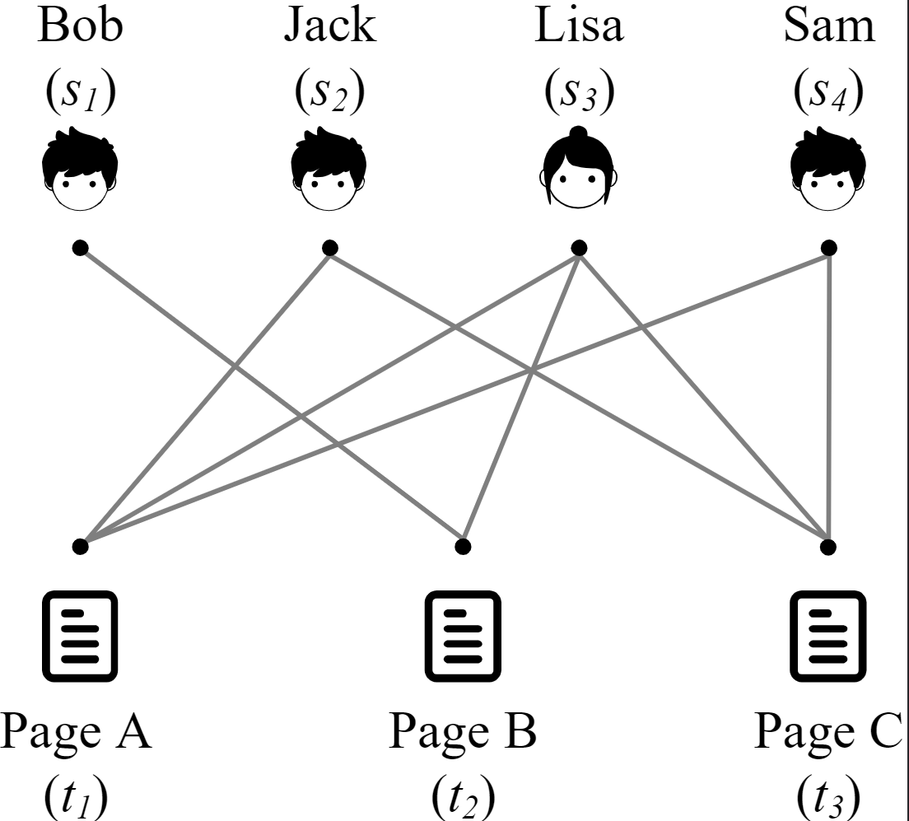

# Sub-Bipartite-Graph-Creator

## Guide

### This program need [Python3](https://www.python.org/downloads/). We recommend using [Anaconda](https://www.anaconda.com/products/individual#Downloads) or [Miniconda](https://docs.conda.io/en/latest/miniconda.html).

### 1. Install environment.

pip install -r ./requirements.txt --user -i http://mirrors.aliyun.com/pypi/simple --trusted-host mirrors.aliyun.com

### 2. Run the program.
python ./main.py

## 介绍
   在当今的数据时代，图作为大数据的一个重要表示结构，得到了很大关注。比如，已经影响到我们日常生活的各个方面电子商务平台和社交网络，可以被建模为一个图。因此，随着图数据的日益增加，许多研究工作都致力于挖掘图数据结构中有价值的信息。通常情况下，有两类图。一类是简单图，其中的连接可以连接任何一对实体。另一类是多部图，其中顶点被分为不同的互不相干的类别，而边只存在于不同类别的顶点之间。
   目前，人们对简单图提出了大量的研究。然而，与简单图相比，多部图，如二部图，受到学术界的关注较少。
## 二部图
   定义：二部图有两个相互独立的不同类别的顶点集，边只存在于不同类别的顶点之间。
   举例：二部图在各个领域无处不在。例如，对于Wiktionary的用户和页面之间的关系，可以用边表示用户在页面上的编辑行为，构成一个二部图。在图中，可以有多个用户合作编辑同一个页面，也可以由一个用户编辑多个页面，但没有用户-用户或页面-页面的联系。下图展示了一个用户-页面关系的二部图的例子。Bob（s1）和Lisa（s3）合作编辑B(t1)页，而Jack(s2)、Lisa(s3)和Sam(s4)合作编辑A(t1)和C(t3)页。
<!--     -->
    
## 二部图分类
   由于二部图无处不在的特性，二部图的分类任务已经成为各个领域的基本工具。
   例如，不同语言的用户和相应的页面组成了不同的二部图。根据不同的语言，这些二部图可以被分类，还可以进一步挖掘不同语言的用户在使用Wiktionary时的习惯差异。而后，可以针对每种语言优化使用Wiktionary的体验。
   二部图分类任务的另一个具体例子可用于洗钱检测。虑到亚马逊等电子商务平台中已知的金钱洗衣周期之间的有向边，我们可以学习这些二部图的特征表示，并进一步利用它们来检测其他潜在的金钱洗衣周期。
   此外，在描述蛋白质结构时，将二级结构之间的相互作用表示为二部图是可行的。而且，二部图的分类可以作为寻找蛋白质中常见亚结构的基础。因此，在寻找具有类似结构的蛋白质时，这项任务也可以发挥重要作用。
