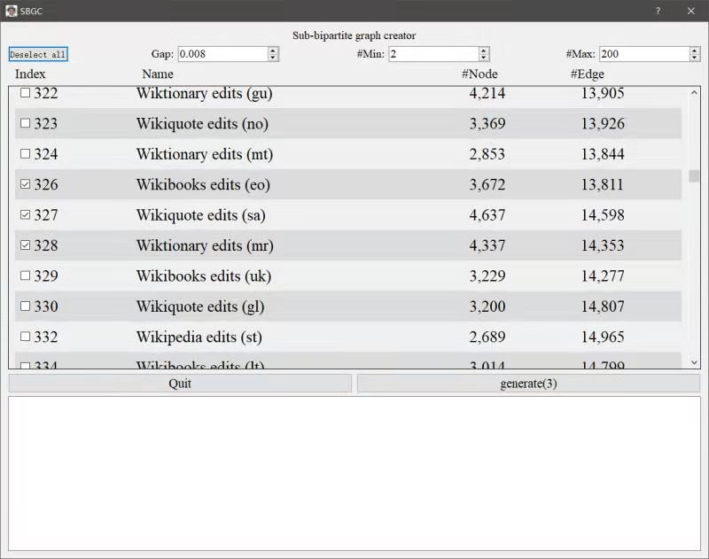

# Sub-Bipartite-Graph-Creator

## Guide

### This program need [Python3](https://www.python.org/downloads/). We recommend using [Anaconda](https://www.anaconda.com/products/individual#Downloads) or [Miniconda](https://docs.conda.io/en/latest/miniconda.html).

### 1. Install environment.

pip install -r ./requirements.txt --user -i http://mirrors.aliyun.com/pypi/simple --trusted-host mirrors.aliyun.com

### 2. Run the program.
python ./main.py

## 介绍
   在当今的数据时代，图作为大数据的一个重要表示结构，得到了很大关注。比如，已经影响到我们日常生活各个方面的电子商务平台和社交网络，我们可以把它们建模为图。因此，随着图数据的日益增加，许多研究工作都致力于挖掘图数据结构中有价值的信息。通常情况下，有两类图。一类是简单图，其中的连接可以连接任何一对实体。另一类是多部图，其中顶点被分为不同的互不相干的类别，而边只存在于不同类别的顶点之间。
   
   目前，人们对简单图提出了大量的研究。然而，与简单图相比，多部图，如二部图，受到学术界的关注较少。

## 二部图
   定义：二部图有两个相互独立的不同类别的顶点集，边只存在于不同类别的顶点之间。
   
   举例：二部图在各个领域无处不在。例如，对于Wiktionary的用户和页面之间的关系，可以用边表示用户在页面上的编辑行为，构成一个二部图。在图中，可以有多个用户合作编辑同一个页面，也可以由一个用户编辑多个页面，但没有用户-用户或页面-页面的联系。下图展示了一个用户-页面关系的二部图的例子。Bob（s1）和Lisa（s3）合作编辑B(t1)页，而Jack(s2)、Lisa(s3)和Sam(s4)合作编辑A(t1)和C(t3)页。
<!--     -->
    

## 二部图分类
   由于二部图无处不在的特性，二部图的分类已经成为各个领域的基本工具。
   
   例如，不同语言的用户和相应的页面组成了不同的二部图。根据不同的语言，这些二部图可以被分类，还可以进一步挖掘不同语言的用户在使用Wiktionary时的习惯差异。然后，可以针对每种语言优化Wiktionary的使用体验。
   
   二部图分类工作还可用于洗钱检测。考虑到亚马逊等电子商务平台中已知的洗钱周期之间的有向边，我们可以学习这些二部图的特征表示，并进一步利用它们来检测其他潜在的洗钱周期。
   
   此外，在描述蛋白质结构时，将二级结构之间的相互作用表示为二部图是可行的。而且，二部图的分类可以作为寻找蛋白质中常见亚结构的基础。因此，在寻找具有类似结构的蛋白质时，本项工作也可以发挥重要作用。

## 问题描述
   定义：根据图的时序信息，从二部图中截出小图，从而达到图分类的目的（默认这些小图属于同一类别）
   
   输入：时间间隔，小图的最小点数，以及最大点数限制
   
   输出：
   （1）原图数据（邻接矩阵）
   
   （2）每个点对应的单个小图
        
   （3）每个小图的标签
      
   
   痛点：
   （1）在二部图分类中，基本没有同类型的小图
   
   （2）带时序信息的二部图数据较少
        
   （3）针对实际情况，需要实现图分类的批处理自动化的过程
   
   （4）根据temporal时序信息进行图分割，可能导致所分割的小图不连通，所以需要进行再分割
   
   （5）方便用户统计数据，提升用户的体验

## 功能描述
（1）选择需要处理的数据，根据当前时间，对每个大图（源数据）创建文件夹，下载源文件

    
   
（2）Download：下载中（下载器）

（3）下载时保留源文件（压缩包格式）

 

（4）进行文件解压，包含源数据的初始节点，目标节点，以及边的类型（解压器）

 

（5）汇总数据

功能优化：

（1）自由拉伸界面

（2）命令输入从终端转至界面中

 

（3）超参输入的2种方法

（4）检测是否已经下载过，避免重复下载

## UI界面美化
（1）数据表格保持对齐（name与data）

（2）表格中上下相邻格子颜色区分

