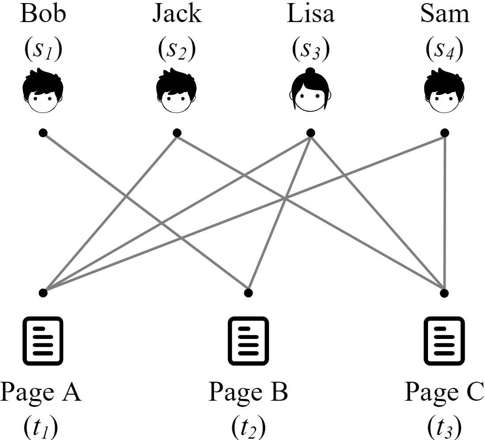
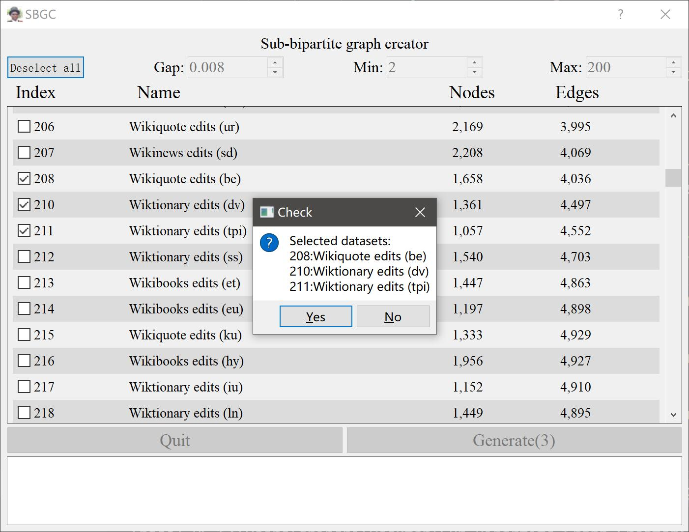
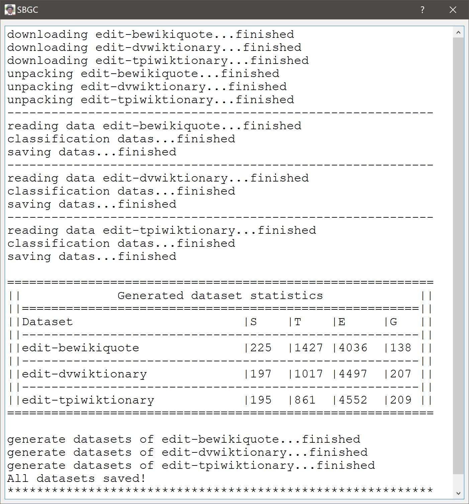

# Sub-Bipartite-Graph-Creator
- [Sub-Bipartite-Graph-Creator](#sub-bipartite-graph-creator)
  - [Guide](#guide)
    - [1. Install environment.](#1-install-environment)
    - [2. Run the program.](#2-run-the-program)
  - [项目介绍(Chinses)](#项目介绍chinses)
    - [背景](#背景)
      - [二部图](#二部图)
      - [二部图分类应用举例](#二部图分类应用举例)
    - [项目描述](#项目描述)
    - [用户使用手册](#用户使用手册)
    - [功能优化](#功能优化)
    - [技术债](#技术债)
      - [无法将项目打包为可执行文件的原因](#无法将项目打包为可执行文件的原因)
      - [规避使用无头浏览器的可行性](#规避使用无头浏览器的可行性)
      - [关于下载“墙外”的Chromium浏览器问题](#关于下载墙外的chromium浏览器问题)
## Guide

**This program need [Python3](https://www.python.org/downloads/). We recommend using [Anaconda](https://www.anaconda.com/products/individual#Downloads) or [Miniconda](https://docs.conda.io/en/latest/miniconda.html).**
The crawled datasets are from [konect.cc](http://konect.cc/networks/).

### 1. Install environment.

pip install -r ./requirements.txt --user -i http://mirrors.aliyun.com/pypi/simple --trusted-host mirrors.aliyun.com

### 2. Run the program.
python ./main.py

Chromium is required to run, please make sure you can access the download [URL](https://storage.googleapis.com/).

---

## 项目介绍(Chinses)

### 背景
在当今的数据时代，作为大数据的一个重要表示结构，图 **(Graph)** 得到了工业界和学术界的广泛关注。比如，我们可以把已经影响到我们日常生活各个方面的电子商务平台和社交网络，建立成一张张的图，来表征其中的信息。随着图数据的日益增加，越来越多的研究工作都开始致力于挖掘图数据中有价值的信息。
通常情况下，图有两大类。一类是简单图，图中的边可以连接任何一对实体。另一类是多部图，图中顶点被分为不同的、互不相干的类别，而边只能连接不同类别的顶点。

#### 二部图
**定义：** 二部图是拥有两种相互独立的不同类别的顶点集、边只存在于不同类别的顶点之间的特殊的多部图结构。

**举例：** 维基词典上的用户和页面之间的编辑与被编辑关系，可以用二部图进行表示。在图中，可以存在多个用户合作编辑同一个页面的情况，也可以存在某一个用户编辑多个维基词典页面的情况，但不能存在用户与用户，或页面与页面之间拥有直接联系的情况。下图展示了一个用户与页面间关系的二部图的例子。 **Bob(s1)** 和 **Lisa(s3)** 合作编辑 **B(t1)** 页面， **Jack(s2)** 、 **Lisa(s3)** 和 **Sam(s4)** 合作编辑 **A(t1)** 和 **C(t3)** 页，但各用户之间不存在联系，各页面之间也不存在联系。

    

#### 二部图分类应用举例

1. 不同语言的用户和他们编写的维基词典页面可以组成不同类别的二部图。对这些数据进一步挖掘，可以实现对用户的分类，或是得到不同母语的用户的使用习惯。

2. 二部图分类可用于检测洗钱行为。利用亚马逊等电子商务平台中已知的洗钱用户之间的联系，我们可以学习这些二部图的特征表示，并进一步利用它们来检测其他潜在的洗钱行为。

3. 在描述蛋白质结构时，将二级结构之间的相互作用表示为二部图是可行的。与此同时，二部图的分类任务可以作为寻找蛋白质中常见亚结构任务的基础。因此，在寻找具有类似结构的蛋白质时，二部图分类任务也可以发挥重要作用。

### 项目描述

本项目旨在利用时序二部图，生成**多类型二部图数据集**，以便在后续进行二部图分类问题的研究。

1. **实现方式：** 
     - 利用某一时序二部图的时序信息，从二部图中截出大小符合要求的连通图，可获得一组同类型的二部图数据集。
     - 利用上述思想，可生成获得多类型二部图数据集。

2. **输入：**
    - 同一张图的节点出现的相对时间间隔（Gap）
    - 生成的图的最小节点数（Min）
    - 生成的图的最大节点数（Max）
    - 多于两张的时序二部图

3. **输出：**
    - 多类型二部图数据集的邻接矩阵
    - 每个节点对应的图序号
    - 每个图的类别标签
    - 新数据集各信息的统计表格

4. **痛点：**
    - 少有公开的多类型二部图数据集
    - 难以筛选、批量下载时序二部图数据集
    - 对原始数据集的处理过程较为繁杂
    - 根据时序信息进行分割，可能获得实验中无法使用的非连通图
    - 难以直接获取新生成的数据集的各类信息，如总点数、边数等

### 用户使用手册

该部分将介绍本项目的各程序界面以及具体使用方法。

1. **初始化运行：** 
   启动爬虫爬取数据集，并对这些数据集进行筛选，只保留时序二部图数据集。网络畅通的情况下，整个过程大约需要十五秒到二十秒 ~~（不要催，在做了）~~。

<figure>
   
   
   
   
</figure>

 

2. **主界面显示：** 
   主界面最上方为程序名；左上角的**Deselect all**按钮用于放弃所有数据集的选择；上方的三个输入框分别为：**Gap:** 浮点型，表示裁剪数据集的时间间隔、**Min:** 整型，表示选择图的最少点数限制、**Max:** 整型，表示选择图的最多点数限制，三个超参的默认值分别为0.008， 2和 200，可调节的范围分别为0.001/~0.999， 2/~99和 3/~1000；界面中央是用于展示数据集信息、选择数据集的信息框；信息框左下方的**Quit**按钮用于退出程序；**Generate**按钮用于生成数据集；下方空白的窗口用于打印生成数据集的过程提示信息。

<figure>
   
</figure>

 

3. **数据集选择：** 
   利用左上角**Deselect all**按钮可取消所有已选数据集；当前已选数据集的数量会显示在右下角**Generate**按钮上；当选择的数据集数量大于等于2时，单击**Generate**按钮会弹出选中的数据集的确认界面；按下确定后将会开始生成由这些数据集为原始数据的多类型二部图数据集。

    

 

4. **数据集下载：** 
   下载器下载并获取数据集源文件。

    

 

5. **数据集解压：** 
   解压器解压所需的数据集。

    

6. **数据集裁剪：** 
   根据设定进行裁剪，获得各数据集的无时序连通子图，并将结果存于以当前时间命名的文件夹中。

    

 

7. **数据集统计：** 
   数据统计，包括每种类型的二部图中的所有**S**节点数量，所有**T**节点数量，总边数以及该类型的图的总数。

    

 

### 功能优化

1. 初始化时提供加载界面，并显示加载过程。
2. UI界面提供信息展示窗口，实时展示当前步骤，并在得到数据集时打印“伪统计表”。

    

 

3. 利用QT5组件，界面可自适应拖拽，超参输入框可手动输入规定范围内的数值，也可鼠标滚轮调节。
4. 下载器于下载前会检查本地是否已有目标数据集，避免重复下载。
5. 数据表格保持对齐。
6. 表格中上下相邻的选项组用统一的底色区分。
7. 生成一次数据集后，可直接回到主界面继续选择生成其他数据集，并提供“一键全不选”功能按钮。

### 技术债
- [x] 健壮的GUI的搭建
- [x] 利用爬虫读取[konect.cc](http://konect.cc/networks/)中的数据集
- [x] 利用H5中的元素实现数据集的筛选
- [x] 实现对数据集的下载与解压
- [x] 实现对数据集的裁剪和生成
- [x] 实现对生成的数据集的信息统计
- [x] 将数据集的统计信息保存至表格文件中 
- [x] 将打印的提示信息转到GUI中显示
- [ ] ~~打包成单个可执行文件~~
- [x] 添加全不选功能按钮

#### 无法将项目打包为可执行文件的原因
我们利用**Pyinstaller**和**fbs**，分别在**Ubuntu**和**Windows**上，都进行了打包的尝试，最终全部失败。但是在测试中我们发现，当将爬虫部分的代码删去，就可以打包成功。考虑到我们所使用的**requests_html**需要使用到**Chromium**浏览器，我们推断认为，无法打包为可执行文件的原因是无法对浏览器进行二次封装。

#### 规避使用无头浏览器的可行性
**答：** ~~臣妾做不到~~ 不可行。数据集由脚本动态生成，再用H5展示。直接对H5进行爬取将无法获得数据集信息。因此，只能使用**requests_html**、**selenium**等库编写爬虫。
**立即推：** 如果是因为浏览器而无法打包，那么除非使用**selenium**库，利用用户自己的浏览器+驱动，否则该问题无解。由于各大浏览器的驱动更新速度不及浏览器本体的更新速度，让用户自己搭建环境较为麻烦。为了打包成可执行文件，反而让用户更加麻烦，不可取。~~直接拿代码跑，万一想改点地方也方便。~~

#### 关于下载“墙外”的Chromium浏览器问题
一方面，不同的操作系统需要使用面向不同平台的浏览器。另一方面，兼容的浏览器版本也可能会随着库的版本更迭而变化，因此不考虑繁琐地提供额外的浏览器下载帮助 ~~，自己百度哇~~。
~~再说了，得靠这玩意儿搞学术的不会翻墙是怎么活下来的。~~
